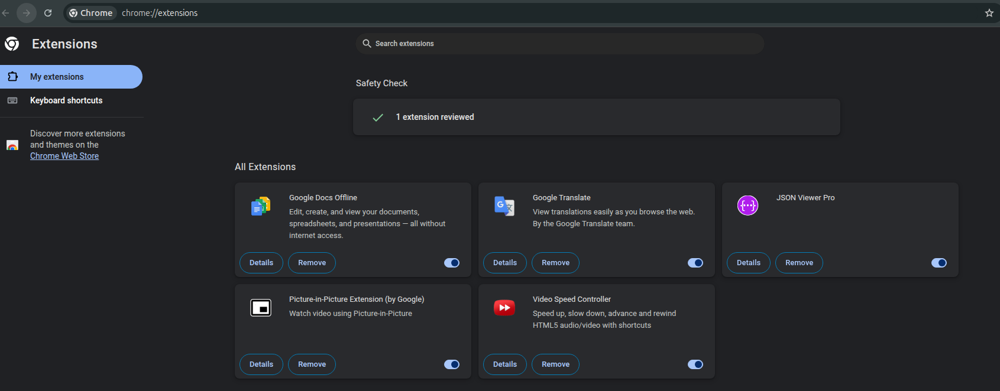
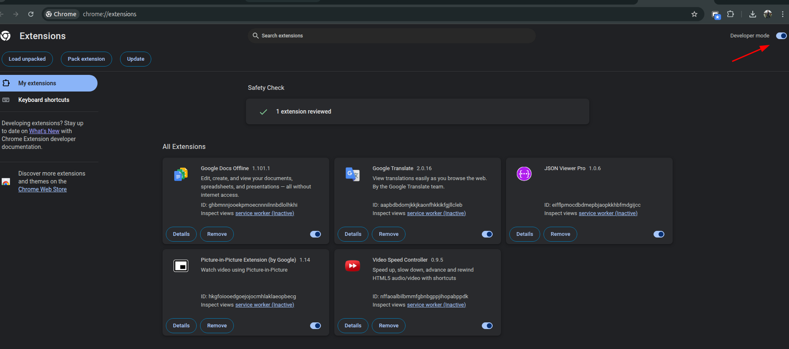
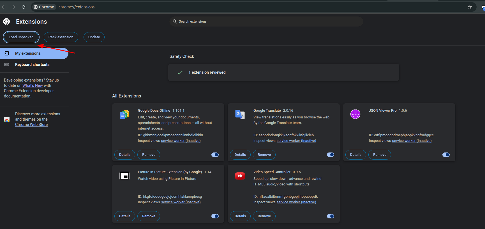
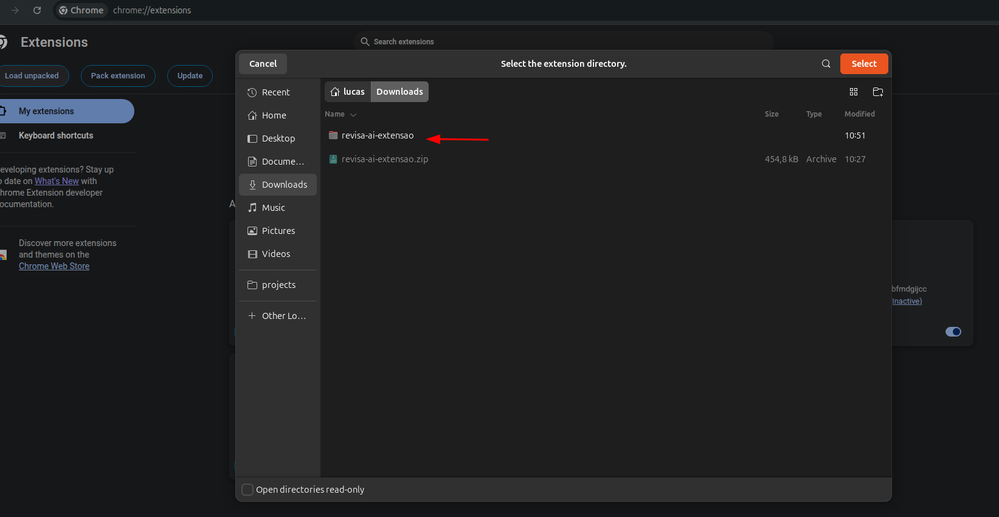
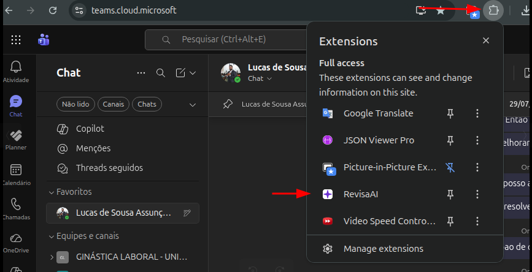
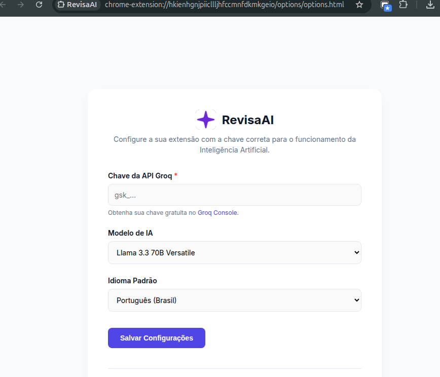

# RevisaAI - Extensão

Uma extensão para o Chrome projetada para revisar e corrigir textos em tempo real.

## ⌨️ Como usar

Após configurar sua chave de API, utilize os seguintes atalhos nos campos de texto:

- **Tab**: Envia o texto para correção/revisão pela IA.
- **Enter**: Aplica a sugestão de correção diretamente no campo.

## 🚀 Como instalar (Modo Desenvolvedor)

Siga os passos abaixo para instalar a extensão no seu navegador Chrome para desenvolvimento:

## 1. Baixe e extraia a extensão  
   Faça o download do arquivo [revisa-ai-extensao.zip](./revisa-ai-extensao.zip) e extraia seu conteúdo para uma pasta de sua preferência.

## 2. Acesse a página de extensões  
   Abra o Chrome e digite `chrome://extensions/` na barra de endereços ou vá em `Menu > Extensões > Gerenciar Extensões`.

   

## 3. Ative o Modo do Desenvolvedor  
   No canto superior direito, ative a chave **Modo do desenvolvedor**.

   

## 4. Carregar extensão sem compactação  
   Clique no botão **Carregar sem compactação** que aparecerá no canto superior esquerdo após ativar o modo desenvolvedor.

   

## 5. Selecione a pasta extraída  
   Na janela de busca de arquivos, navegue até a pasta onde você extraiu o conteúdo do arquivo `.zip` e clique em **Selecionar**.

   

## 6. Verifique a instalação  
   A extensão RevisaAI deverá aparecer na sua lista de extensões ativas.

   

## 7. Configure a sua Chave de API  
   Agora, acesse as opções da extensão para configurar a sua chave de API da Groq. Isso permitirá que a extensão utilize a IA para as correções.

   

---
